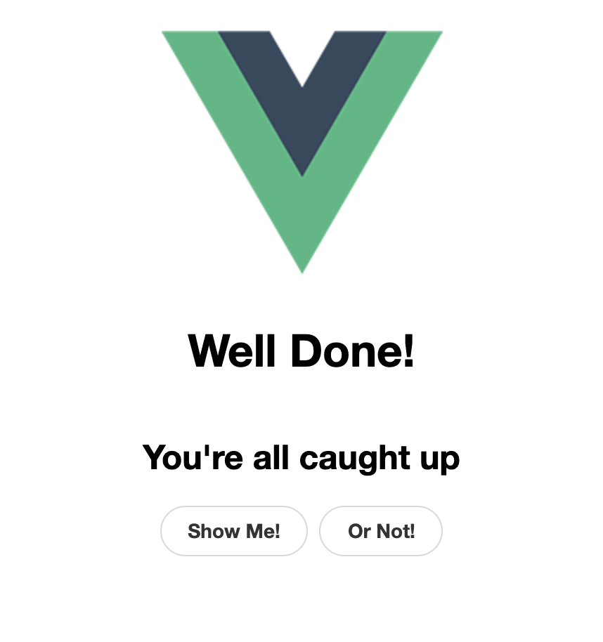

# simple-empty-state

Simple to use `EmptyState` component. It exposes `slots` for the following sections:

* image-placeholder
* title
* hint (or subtitle)
* action

# Usage example

```javascript
<empty-state >
    <template v-slot:image-placeholder>
         
    </template>
    <template v-slot:title>
        <h1>Well Done!</h1>
    </template>
    <template v-slot:hint>
        <h2>You're all caught up</h2>
    </template>
    <template v-slot:action>
        <Button label="Show Me!"></Button>
        <Button label="Or Not!"></Button>
    </template>
</empty-state>`

```

Below you can preview an empty state with all features. More previews can be seen in the storybook stories.



# Development

## Project setup
```
npm install
```

### Compiles and hot-reloads for development
```
npm run storybook
```

### Run your unit tests
```
npm run test:unit
```

### Lints and fixes files
```
npm run lint
```